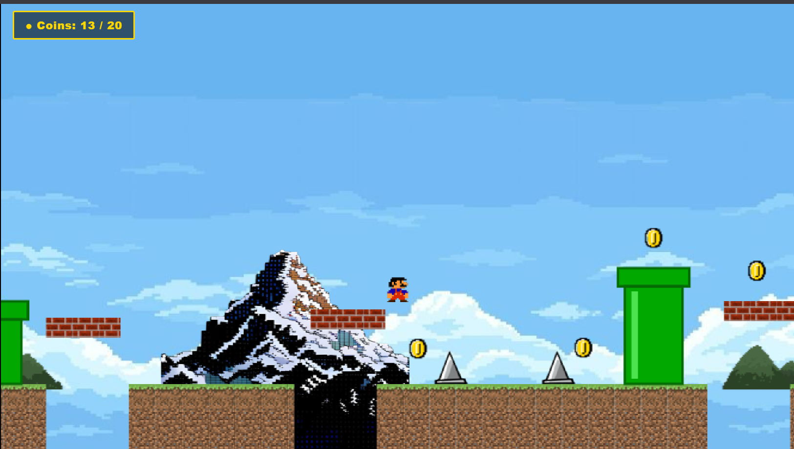

# Mario2

A small Mario type platformer game which I made for ArcadeAI YSWS

---

## How it started

Sooo the whole base code for this game was generated using a prompt on the **Claude Sonnet AI (High) Model**. I did not write the first version as specified in Stage One. The detailed and exact prompt I used is:

> Create a complete html css and js mario style platformer game using no external libraries or images add a camera that follows the player the character can be a simple rectangle for now add gravity and jumping physics space to jump a and d to go left and right add a goal door at the end of the level to complete it add some obstacles like spikes triangular touching them would show game over and restart button add coins also a score/coin countre at the top left and add a simple start screen game over game finsihed screens and level restarts on death draw everything in canvas 2d api only use bright colors and make sure to make html css and js files sepeartely

After this I took the generated code and started building on top of it manually, changing and adding stuff until it became an actual proper game.

---

## What I Changed for Stage Two

- **Assets** - Changed the rectangle placeholder and other plain shapes to actual assets
- **Sound Effects and BGM** - Added sound effects for jump, coin, death, win, and powerup plus BGM :3
- **Improved Level** - Added more platforms and pipes, pits etc., made it longer
- **PowerUps** - Added powerups to make Mario invincible for some time
- **Sword** - Sword for final boss battle to kill ender dragon
- **Particle Effects** - Added particle effects to jump, coin, and attack
- **Boss Fight** - Added ender dragon to fight
- **Menu and HUD** - Improved HUD and menu!

---

## Time Spent (excluding AI work)

---

## Tech Stack

Kept it very simple no framework or library used anywhere.

- HTML
- CSS
- JavaScript (vanilla)

Everything is rendered using the Canvas 2D API only.

---

## Folder Structure

- `assets/` has all the images used in the game like player, dragon, tiles, coin, powerup etc
- `music/` has all the sound effects and background music files
- `screenshots/` has screenshots of my dev logs while building this

---

## Screenshots

